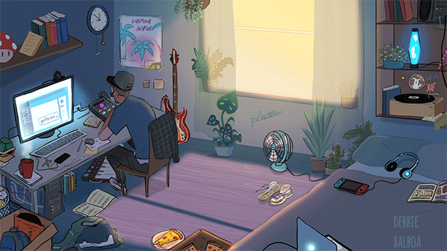

Me chamo Alexandre Ferreira, tenho 25 anos e sou desenvolvedor backend júnior com Laravel e Node. Utilizo este repertório para postar meus projetos de estudo e também ajudar outros desenvolvedores iniciantes. 

### Sobre mim
Minha jornada profissional começou quando ganhei meu primeiro computador 💻 e me apaixonei pela informática. Com o tempo, fui ganhando experiência trabalhando como suporte técnico e atendimento ao cliente, o que me ajudou a aprimorar minhas habilidades de comunicação e solução de problemas 💬 ✨ Desde então, já participei de alguns "freelas", nos quais trabalhei com PHP, MySQL e WordPress, desenvolvendo websites institucionais e blogs 🌐 Estou continuamente estudando para aprimorar meus conhecimentos em desenvolvimento web visando me tornar um profissional ainda mais completo. 

## Skills 

  &nbsp;
  &nbsp;
  &nbsp;
  &nbsp;
  &nbsp;
  &nbsp;
  &nbsp;

